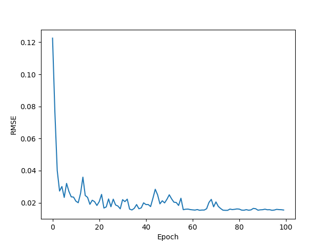
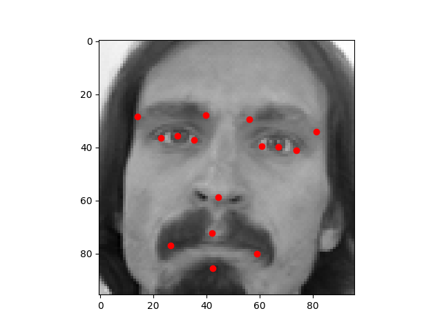

# Face-features

This project is using a Convolutionnal Neural Network to predict 15 facial
keypoints.
The data can be found [here](https://www.kaggle.com/c/facial-keypoints-detection/data)

## Results

The CNN was trained during 100 epochs with a batch size of 64.
The RMSE graph of the test set looks like this:

Here is an example of keypoints prediction:

